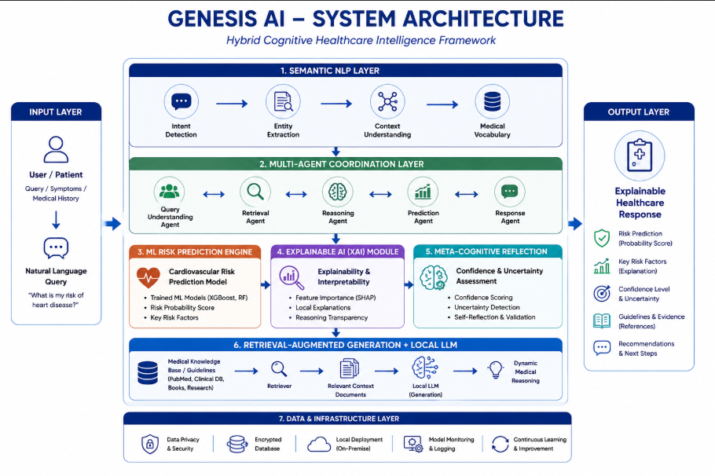
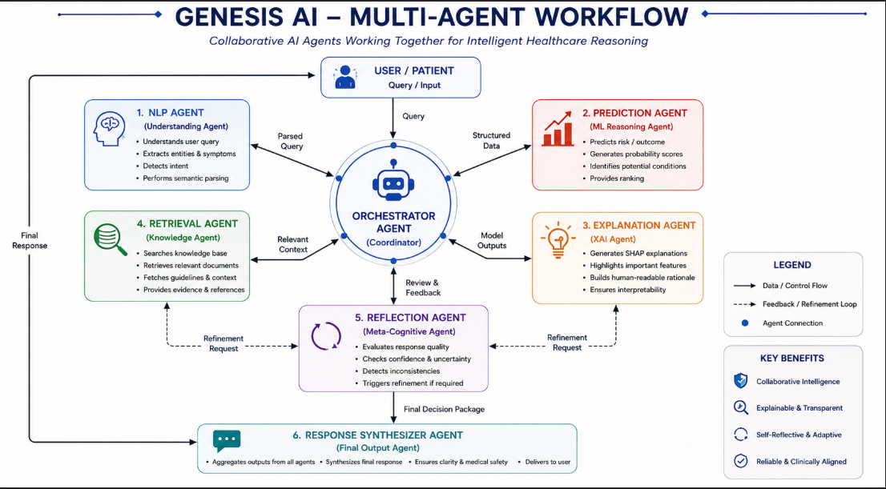
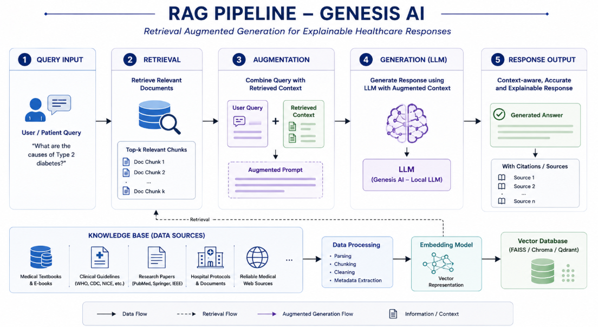
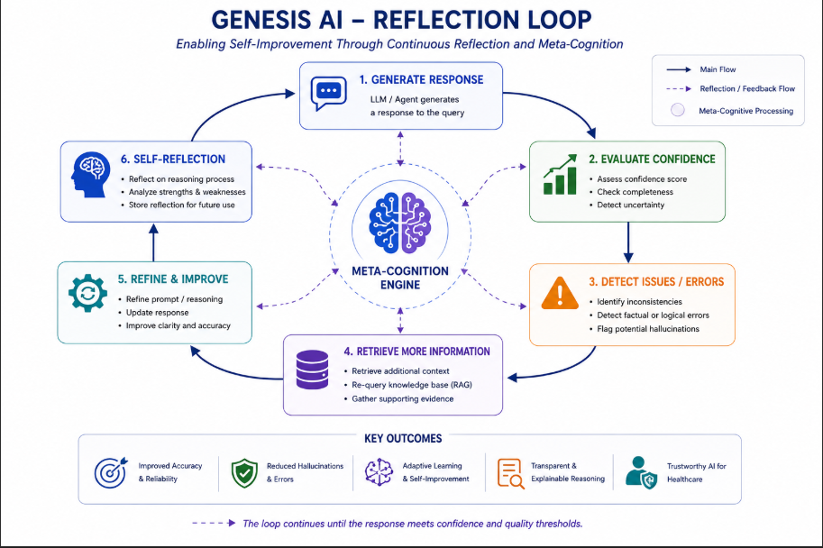
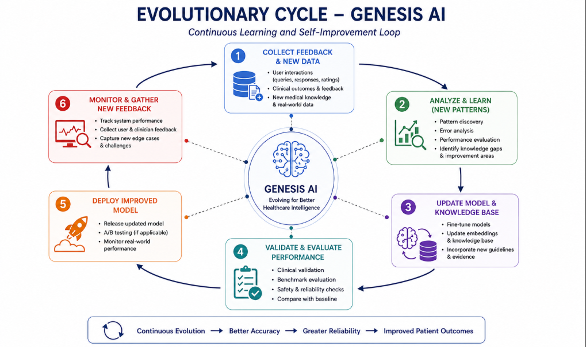
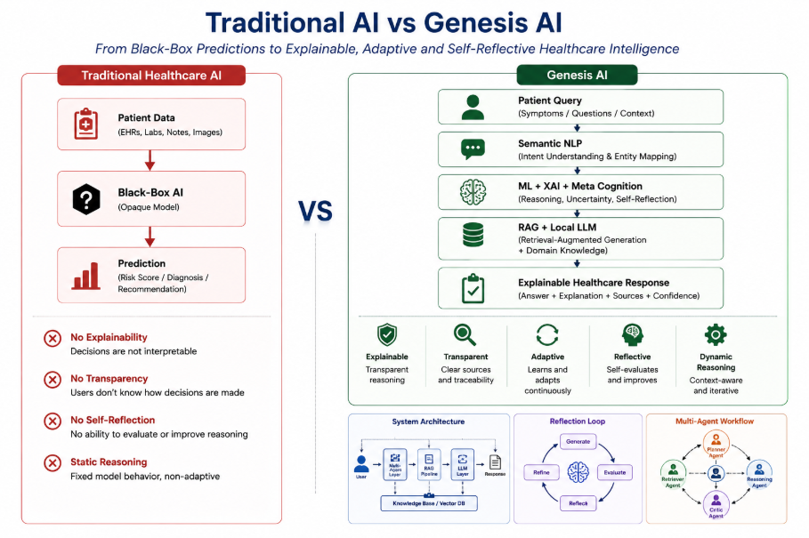
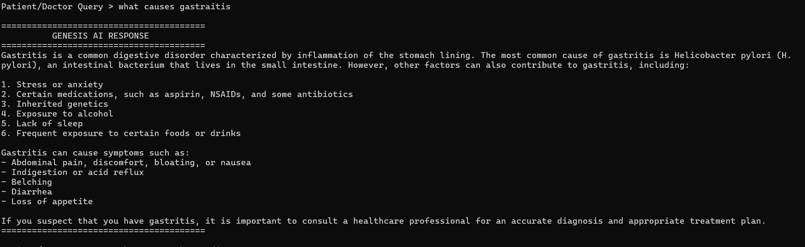
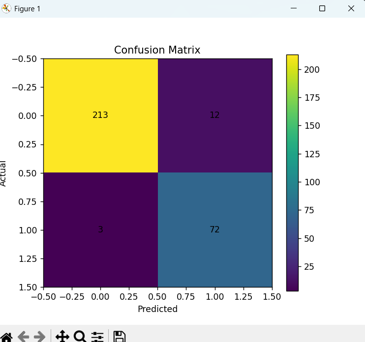

<div align="center">

# Genesis AI

### Self-Evolving Cognitive Agent System

Autonomous Reasoning • Explainable AI • Multi-Agent Intelligence • Evolutionary Optimization

</div>

---

# System Architecture



---

# Multi-Agent Workflow



---

# Retrieval-Augmented Generation Pipeline



---

# Meta-Cognitive Reflection Loop



---

# Evolutionary Optimization Cycle



---

# Conversational AI Interface



---

# Explainable AI Output



---

# Feature Importance Analysis


---

# Confusion Matrix



---

# Performance Comparison


---

# Local LLM Integration


---

# Overview

Genesis AI is a self-evolving cognitive AI framework designed to simulate autonomous reasoning workflows through explainable decision-making, reflective self-assessment, adaptive optimisation, and multi-agent intelligence.

The system integrates:

- Explainable AI (XAI)
- Meta-Cognitive Reflection
- Evolutionary Algorithms
- Retrieval-Augmented Generation (RAG)
- Multi-Agent Coordination
- Conversational AI

within a unified healthcare-oriented reasoning architecture.

---

# Core Capabilities

- Autonomous healthcare risk analysis
- Confidence-aware reflective reasoning
- SHAP-powered explainability
- Multi-agent task orchestration
- Evolutionary reasoning optimisation
- Context-aware retrieval pipelines
- Conversational AI interaction

---

# Technology Stack

| Domain | Technologies |
|---|---|
| AI/ML | Scikit-Learn, SHAP, LangChain |
| Generative AI | RAG, LLaMA 3, Groq API |
| Agentic Systems | Multi-Agent Coordination |
| Optimization | Genetic Algorithms (DEAP) |
| NLP | NLTK, Conversational Parsing |
| Backend | Python, FastAPI |
| Data | Pandas, NumPy, Matplotlib |

---

# Local Setup

```bash
git clone https://github.com/RGR57/genesis-ai-healthcare.git

cd genesis-ai-healthcare

pip install -r requirements.txt

streamlit run streamlit_app.py
```

---

# Disclaimer

This project is intended for educational and research purposes only.

It is not designed for clinical diagnosis or real-world medical decision-making.

---
